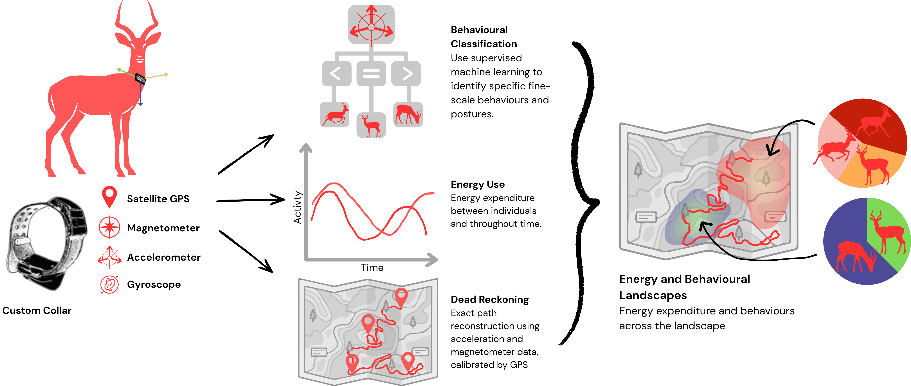

# ImpalaProject

Code for behavioural analysis of impala data.

## Part 1: Data Wrangling
Much of this code is concerned with extracting the data from the Artemis boards' duel accelerometer and GPS loggers. Due to challenges with timestamps, data corruption, and inconsistent formatting, this was very challenging. Problem was solved with heavy assist from Chris Clemente (his parallel code for the same solution is available at: [https://github.com/cclemente/Collar_data_extraction](https://github.com/cclemente/Collar_data_extraction)) and I have updated my code to reflect his changes.

The next section is for roughly aligning each of the videos with the corresponding section of the accelerometer data. This was finicky as every camera had a different datetime encoding and therefore there is a lot of manual work required.

## Part 2: Creation of Training Data
These matched data sources (accel and video) were then imported into the custom matlab GUI designed by [Chris Clemente](https://github.com/cclemente/Animal_accelerometry/tree/main/Matlab_scripts). A newer version of the GUI ([Sync Station GUI for Data Annotation](https://github.com/OakAlice/ImpalaProject/tree/main/Scripts/Sync_Station)) includes minor modifications making it more accesible for Mac users, as well as enabling multiple layers of simultaneous behavioural annotation. Each accelerometer section was manually annotated according to the behaviours in the corresponding video.

## Part 3: Developing Supervised Classification Model
Fill in later.

## Acknowledgements 
Project was conceptualised and funding aquired by Chris Clemente. Collars designed and built by Jasmin Annett, Robin Maag, Chris Clemente, and Chris Bird. Ethics obtained and managed by Jasmin Annett. Data collected by Jasmin Annett, Robin Maag, Chris Clemente, and Taylor Dick. Training data annotated by various research assistants and students incl. Senna Stewart and Amelia Nelson. Data analysis by me.
